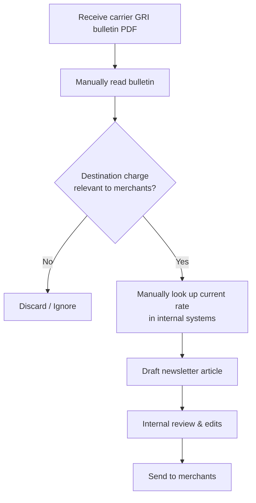
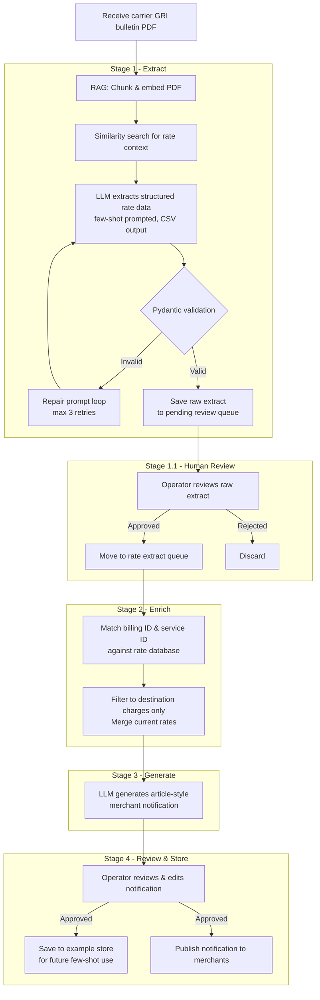

> **Note:** This project represents my first experience building a full-scale application and my initial journey into **LLM Orchestration**. As a beginner in this space, I moved beyond standalone scripts to design a complete, multi-step pipeline. This fictitious logistics use case served as a training ground for mastering core engineering patterns: **Few-Shot Prompting**, **Human-in-the-Loop (HITL)**, and **Pydantic** validation.
> *Note: All data and organizations (e.g., SwiftParcel) are fictitious and created for educational purposes.*
---

# 📬 Automated Newsletters

An automated pipeline that processes carrier General Rate Increase (GRI) bulletins, enriches rate data with current rates from an internal database, and generates client-ready notification articles — reducing manual effort and ensuring only relevant destination charges reach merchants.

---

## 🏢 About SwiftParcel

SwiftParcel is a last-mile delivery operator specialising in cross-border e-commerce. Merchants ship their goods internationally via a freight forwarder — once the shipment arrives at the destination country, SwiftParcel takes over, handling the final delivery directly to the end consumer.

As a destination-side operator, SwiftParcel incurs and passes through **destination charges** — such as fuel surcharges, remote area delivery fees, and peak season surcharges — to its merchant clients. When carriers revise these rates via a GRI bulletin, SwiftParcel is committed to communicating the changes clearly and promptly so merchants can plan accordingly.

---

## 📌 Business Problem

Freight carriers periodically publish GRI bulletins announcing rate changes across their full rate card. As a destination-side last-mile operator, SwiftParcel is only responsible for **destination charges**. A significant portion of any bulletin is therefore irrelevant to our merchants:

| Category | Examples | Passed to merchants? |
|---|---|---|
| **Destination charges** | Fuel surcharge, remote area delivery, peak season, residential address surcharge | ✅ Yes — SwiftParcel's core service costs |
| **Origin charges** | Export documentation, origin port handling, cargo inspections | ❌ No — incurred at the origin country before SwiftParcel's involvement |
| **Specialised cargo charges** | Hazmat handling, cold chain, bulk cargo fees | ❌ No — outside SwiftParcel's standard parcel service |

Summarising these bulletins into merchant newsletters is currently a manual, time-consuming process with two key challenges:

1. **Relevance filtering** — Bulletins must be read carefully to identify only the destination charges that fall within SwiftParcel's service scope.
2. **Rate enrichment** — Bulletins only state the *new* rate. The *current* rate must be looked up from an internal rate database for the notification to be meaningful to merchants.

This pipeline automates the full workflow: extract → enrich → generate → review → publish.

---

## 🔄 Process Flows

### As-Is (Manual Process)



### To-Be (Automated Pipeline)



---

## ⚙️ Setup

### Prerequisites

- Python 3.10+
- Apple Silicon Mac recommended (pipeline uses MPS acceleration); CUDA also supported via PyTorch
- [Hugging Face account](https://huggingface.co/) with access to `microsoft/Phi-4-mini-instruct`

### Installation

```bash
# 1. Clone the repository
git clone https://github.com/your-username/automated_newsletters.git
cd automated_newsletters

# 2. Create and activate a virtual environment
python -m venv venv
source venv/bin/activate  # Windows: venv\Scripts\activate

# 3. Install dependencies
pip install -r requirements.txt
```

### Configuration

All paths and model settings are managed in `app/config.yaml`. Key entries:

```yaml
queues:
  input:
    pending_process_dir: "infrastructure/queues/pending_process"
  review:
    raw_extract_dir: "infrastructure/queues/pending_review/raw_extract"
    newsletter_dir: "infrastructure/queues/pending_review/newsletter"
  output:
    newsletter_dir: "infrastructure/queues/completed/newsletter"
    raw_extract_dir: "infrastructure/queues/completed/raw_extract"

database:
  csv:
    fee_database_csv: "infrastructure/database/fee_database/fee_database.csv"
  store:
    raw_extract_example_store_dir: "infrastructure/database/example_store/examples/raw_fee_extract/store"
    newsletter_example_store_dir: "infrastructure/database/example_store/examples/newsletter/store"

model_id:
  phi4: "microsoft/Phi-4-mini-instruct"
```

### Running the Pipeline

The pipeline is operated via an interactive CLI:

```bash
# From project root
python app/entrypoints/main.py
```

```
========================================
  Automated Newsletters - Pipeline CLI
========================================
  1. Run full pipeline
  2. Extract fees from PDF
  3. Review raw extract
  4. Generate newsletter
  5. Review newsletter
  6. Save examples to store
  0. Exit
========================================
```

Stages can be run individually (e.g. to re-run generation after editing a raw extract) or as a full end-to-end pipeline via option 1.

To initialise or reset the few-shot example store:

```bash
python app/entrypoints/view_store.py
```

---

## 🗂️ Project Structure

```
automated_newsletters/
├── app/
│   ├── entrypoints/
│   │   ├── main.py                   # Interactive CLI entry point
│   │   ├── view_store.py             # Initialise / reset few-shot example store (to be added in pipeline.py)
│   ├── pipeline/
│   │   ├── pipeline.py               # Orchestration logic — wires all stages together
│   │   ├── extraction.py             # Stage 1: PDF extraction & validation
│   │   ├── generate.py               # Stage 3: Newsletter generation
│   │   └── review.py                 # Stage 1.1 & 4: Human review & example saving
│   ├── domain/
│   │   ├── fees/
│   │   │   └── match_fee.py          # Stage 2: Rate lookup & destination charge filtering
│   │   ├── llm/
│   │   │   ├── local_llm.py          # LLM loader (LRU-cached)
│   │   │   ├── prompt_templates.py   # Prompt construction (extraction & newsletter)
│   │   │   └── llm_validation.py     # Pydantic schema & output validation
│   │   └── retrieval/
│   │       ├── vector_store.py       # PDF embedding & RAG
│   │       └── example_store.py      # Few-shot example management
│   ├── infrastructure/
│   │   ├── database/
│   │   │   ├── fee_database/         # Internal destination rate database (CSV)
│   │   │   └── example_store/        # ChromaDB few-shot stores
│   │   └── queues/
│   │       ├── pending_process/      # Drop PDFs here to begin pipeline
│   │       ├── pending_review/       # Awaiting operator review (raw extract & newsletter)
│   │       └── completed/            # Approved outputs
│   └── utils/
│       ├── config.py                 # YAML config loader & base path
│       ├── logger.py                 # Logging setup
│       └── system_commands.py        # OS file-open helper
├── app/config.yaml
└── requirements.txt
```

---

## 🧠 Methods & Frameworks

| Technique | Purpose |
|---|---|
| **RAG (Retrieval-Augmented Generation)** | Chunks and embeds the PDF; similarity search retrieves only rate-relevant context before prompting the LLM, reducing noise and hallucination |
| **Few-shot prompting** | Approved past extractions are stored in ChromaDB and injected as examples into the prompt at runtime, improving LLM consistency on new bulletins |
| **CSV output format** | Smaller instruction-following models perform more reliably with flat CSV output than structured JSON; Pydantic acts as the schema contract independently |
| **Pydantic validation** | Validates every field of the LLM's output (types, date format, allowed literals, rate ranges) against a schema; structured errors are fed back into a repair prompt loop |
| **Repair prompt loop** | If validation fails, the previous output and error are passed back to the LLM with instructions to self-correct, up to 3 attempts |
| **Billing ID & service ID matching** | Destination charges are matched against the internal rate database using exact `billing_id` + `service_id` keys, ensuring precise rate enrichment |
| **Destination charge filtering** | `match_fee.py` filters the rate database to active destination charges only before merging, so origin and specialised cargo charges are never surfaced to merchants |
| **Human-in-the-loop** | Two review gates — after raw extraction and after article generation — ensure operator oversight before any output is published or saved as a training example |
| **LRU-cached LLM loading** | The model is loaded once and cached via `@lru_cache`; explicit cache clearing + `gc.collect()` + `torch.mps.empty_cache()` releases memory after use |

---

## 📦 Key Dependencies

| Library | Role |
|---|---|
| `langchain`, `langchain-huggingface` | LLM chaining, prompt templates, HuggingFace integration |
| `transformers`, `torch` | Local model inference (Phi-4-mini-instruct, MPS/bfloat16) |
| `langchain-chroma`, `chromadb` | Vector store for RAG and few-shot example retrieval |
| `sentence-transformers` | Embedding model (`BAAI/bge-m3`) for PDF chunks and examples |
| `pydantic` | Schema definition and output validation |
| `pandas` | Data manipulation and CSV handling |
| `rapidfuzz` | Fuzzy string matching for rate name lookup |
| `pypdf` | PDF loading |
| `PyYAML` | Config management |

---

## 📝 Purpose

This project is for internal/personal use.

## ⚠️ Limitations

**Fee updates only** — The pipeline is designed and tested for rate update scenarios only. New fee introductions and fee removals are recognised during extraction but are not carried through the enrichment and generation stages.

**Document length** — Very long bulletins with fee tables spread across many pages may result in incomplete extractions, as the RAG retrieval may not surface all relevant sections. The SLM (`Phi-4-mini-instruct`) also has a maximum output length, which may cause truncation when a bulletin contains a large number of rate changes.

**Input format** — Only text-based PDF files are supported. Bulletins delivered as HTML emails or Word documents are not compatible. Scanned or image-based PDFs will not extract correctly as the pipeline relies on embedded text.

**Rate database dependency** — Enrichment depends on the internal fee database being current and using consistent billing identifiers. If a carrier changes their rate card structure between bulletins, the enrichment step may return no matches.

**Single bulletin per run** — Only one bulletin can be processed per run. The input file is configured manually in `pipeline.py`.

**Hardware** — Tested on an Apple Silicon MacBook Pro (16GB unified memory) using MPS acceleration. A minimum of 16GB unified memory is recommended. CUDA-capable GPUs are theoretically supported with minor code changes in `local_llm.py` and `vector_store.py`, but this has not been tested. CPU-only inference is not recommended.