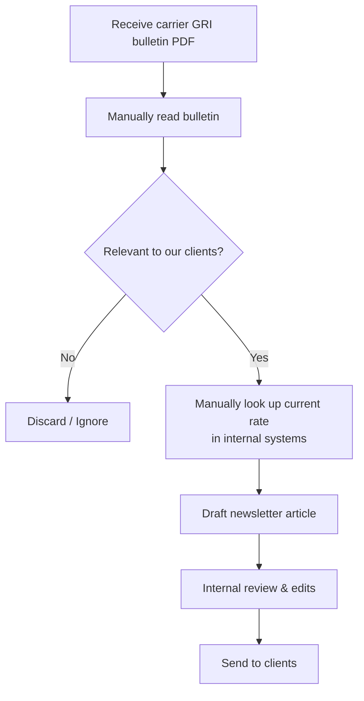
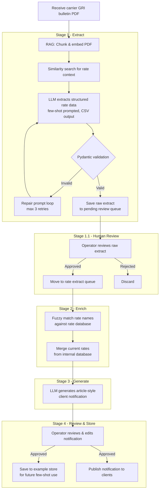

# 📬 Automated Newsletters

An automated pipeline that processes carrier General Rate Increase (GRI) bulletins (e.g. SwiftFreight), enriches rate data with current rates from an internal database, and generates client-ready notification articles — reducing manual effort and ensuring only relevant rate information reaches clients.

---

## 🏢 About SwiftFreight

SwiftFreight is a last-mile logistics operator specialising in cross-border e-commerce delivery. We work with online merchants looking to ship goods internationally — consolidating shipments from multiple clients and partnering with international freight carriers for the cross-border transit leg. Upon arrival at the destination country, SwiftFreight manages the final delivery directly to the end consumer.

As a consolidator and last-mile operator, we absorb and pass through carrier-imposed surcharges — such as fuel surcharges and General Rate Increases (GRIs) — to our merchant clients. When carriers adjust their rates, we are committed to communicating these changes clearly and promptly, so merchants can plan accordingly.

---

## 📌 Business Problem

Freight carriers periodically publish GRI bulletins announcing rate changes across their full rate card. As a last-mile consolidator, SwiftFreight only owns a specific leg of the delivery journey — the destination last-mile — and only passes through surcharges that fall within that scope. This means a significant portion of any bulletin is irrelevant to our merchants.

Charges that do **not** apply to SwiftFreight merchants include:

- **Origin charges** — export documentation, origin port handling, and cargo inspections at the shipper's end; these are costs borne at the origin country, before SwiftFreight's involvement
- **Customs duties & import taxes** — levied on the end consumer or importer, not on SwiftFreight as the delivery operator
- **Specialised cargo surcharges** — hazardous materials handling, refrigerated/cold chain, or bulk cargo fees that fall outside SwiftFreight's standard parcel service

Summarising these bulletins into merchant newsletters is currently a manual, time-consuming process with two key challenges:

1. **Relevance filtering** — Bulletins must be read carefully to identify only the surcharges that apply to SwiftFreight's last-mile parcel service and are passed through to merchants.
2. **Rate enrichment** — Bulletins only state the *new* rate. The *current* rate must be looked up from an internal rate database for the notification to be meaningful to merchants.

This pipeline automates the full workflow: extract → enrich → generate → review → publish.

---

## 🔄 Process Flows

### As-Is (Manual Process)



### To-Be (Automated Pipeline)



---

## ⚙️ Setup

### Prerequisites

- Python 3.10+
- Apple Silicon Mac recommended (pipeline uses MPS acceleration); CUDA also supported via PyTorch
- [Hugging Face account](https://huggingface.co/) with access to `microsoft/Phi-4-mini-instruct`

### Installation

```bash
# 1. Clone the repository
git clone https://github.com/your-username/automated_newsletters.git
cd automated_newsletters

# 2. Create and activate a virtual environment
python -m venv venv
source venv/bin/activate  # Windows: venv\Scripts\activate

# 3. Install dependencies
pip install -r requirements.txt
```

### Configuration

All paths and model settings are managed in `app/config.yaml`. Key entries:

```yaml
input:
  pdf_input_path: "app/infrastructure/queues/file_input"

output:
  raw_extract_path: "app/infrastructure/queues/pending_review/raw_extract"
  notifications_path: "app/infrastructure/queues/notifications"

database:
  fee_database_csv: "app/infrastructure/database/fee_database/fee_database.csv"
  example_store_path: "app/infrastructure/database/example_store"

model_id:
  phi4: "microsoft/Phi-4-mini-instruct"
```

### Running the Pipeline

```bash
# From project root
python app/entrypoints/main.py
```

To initialise or reset the few-shot example store:

```bash
python app/domain/retrieval/example_store.py
```

---

## 🗂️ Project Structure

```
automated_newsletters/
├── app/
│   ├── entrypoints/
│   │   └── main.py                   # Pipeline entry point
│   ├── pipeline/
│   │   └── pipeline.py               # Orchestration logic
│   ├── domain/
│   │   ├── fees/
│   │   │   └── match_fee.py          # Rate lookup & fuzzy matching
│   │   ├── llm/
│   │   │   ├── local_llm.py          # LLM loader (cached)
│   │   │   ├── prompt_templates.py   # Prompt construction
│   │   │   └── llm_validation.py     # Pydantic output validation
│   │   └── retrieval/
│   │       ├── vector_store.py       # PDF embedding & RAG
│   │       └── example_store.py      # Few-shot example management
│   ├── infrastructure/
│   │   ├── database/
│   │   │   ├── fee_database/         # Internal rate database CSV
│   │   │   └── example_store/        # ChromaDB few-shot store
│   │   └── queues/
│   │       ├── file_input/           # Drop PDFs here
│   │       ├── pending_review/       # Awaiting operator review
│   │       └── notifications/        # Generated articles
│   └── utils/
│       ├── config.py                 # YAML config loader
│       └── logger.py                 # Logging setup
├── app/config.yaml
└── requirements.txt
```

---

## 🧠 Methods & Frameworks

| Technique | Purpose |
|---|---|
| **RAG (Retrieval-Augmented Generation)** | Chunks and embeds the PDF; similarity search retrieves only rate-relevant context before prompting the LLM, reducing noise and hallucination |
| **Few-shot prompting** | Approved past extractions are stored in ChromaDB and injected as examples into the prompt at runtime, improving LLM consistency on new bulletins |
| **CSV output format** | Smaller instruction-following models perform more reliably with flat CSV output than structured JSON; Pydantic acts as the schema contract independently |
| **Pydantic validation** | Validates every field of the LLM's output (types, date format, allowed literals, rate ranges) against a schema; structured errors are fed back into a repair prompt loop |
| **Repair prompt loop** | If validation fails, the previous output and error are passed back to the LLM with instructions to self-correct, up to 3 attempts |
| **Fuzzy matching (rapidfuzz)** | Rate names in bulletins often differ slightly from internal database names; `token_sort_ratio` matching bridges this gap without requiring exact string equality |
| **Human-in-the-loop** | Two review gates — after raw extraction and after article generation — ensure operator oversight before any output is published or saved as a training example |
| **LRU-cached LLM loading** | The model is loaded once and cached via `@lru_cache`; explicit cache clearing + `gc.collect()` + `torch.mps.empty_cache()` releases memory after use |

---

## 📦 Key Dependencies

| Library | Role |
|---|---|
| `langchain`, `langchain-huggingface` | LLM chaining, prompt templates, HuggingFace integration |
| `transformers`, `torch` | Local model inference (Phi-4-mini-instruct, MPS/bfloat16) |
| `langchain-chroma`, `chromadb` | Vector store for RAG and few-shot example retrieval |
| `sentence-transformers` | Embedding model (`BAAI/bge-m3`) for PDF chunks and examples |
| `pydantic` | Schema definition and output validation |
| `pandas` | Data manipulation and CSV handling |
| `rapidfuzz` | Fuzzy string matching for rate name lookup |
| `pypdf` | PDF loading |
| `PyYAML` | Config management |